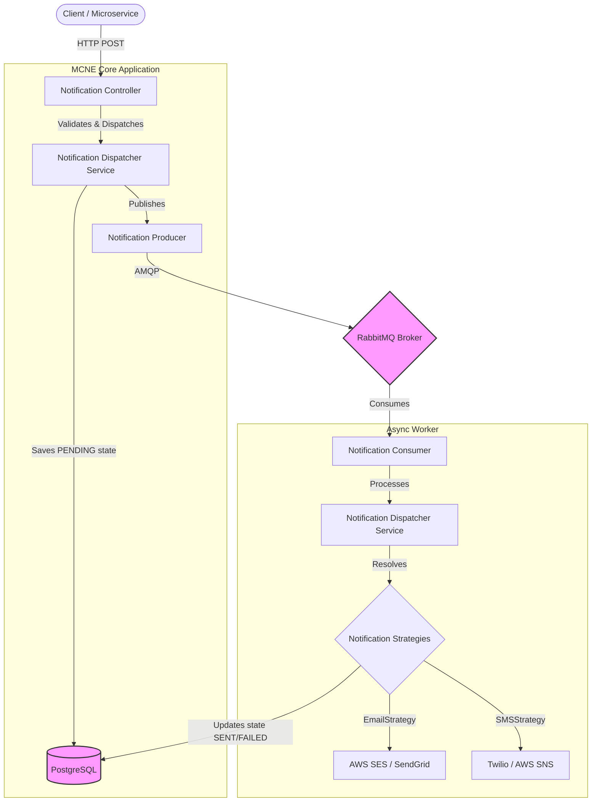
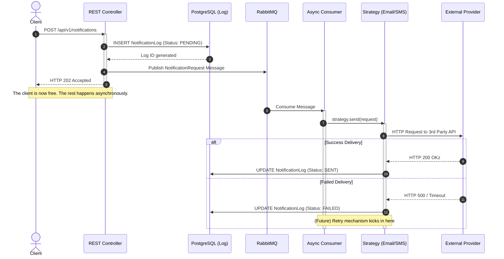
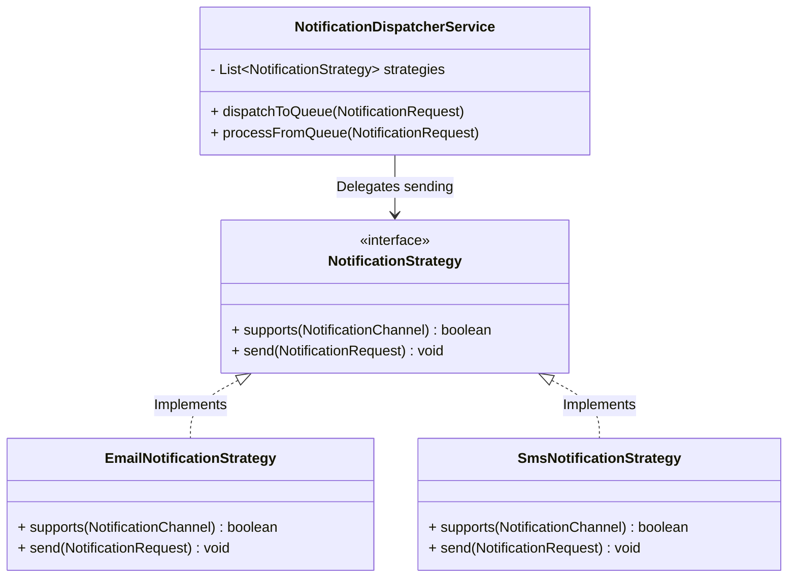

# System Architecture - Multi-Channel Notification Engine (MCNE)

This document provides a visual and technical breakdown of the MCNE architecture, focusing on its decoupled, asynchronous, and extensible design.

---

## 1. High-Level System Architecture

The system is designed around an event-driven architecture using RabbitMQ to decouple the HTTP ingestion layer from the actual external API delivery layer. This ensures that a spike in incoming requests does not overload external providers (like AWS SES or Twilio) and prevents clients from waiting for synchronous I/O operations.

---

## 2. Sequence Diagram (Asynchronous Flow & Timing)

This diagram illustrates the chronological flow of a notification request. Notice how the HTTP thread is freed almost immediately (returning a `202 Accepted`), while the heavy lifting is done in the background by a separate worker thread.

---

## 3. Component Diagram (The Strategy Pattern)

The engine uses the **Strategy Design Pattern** to adhere to the Open/Closed Principle (OCP) from SOLID. If we need to add a new channel (e.g., Push Notification or Slack), we simply create a new class implementing the `NotificationStrategy` interface without touching the core `NotificationDispatcherService`.

