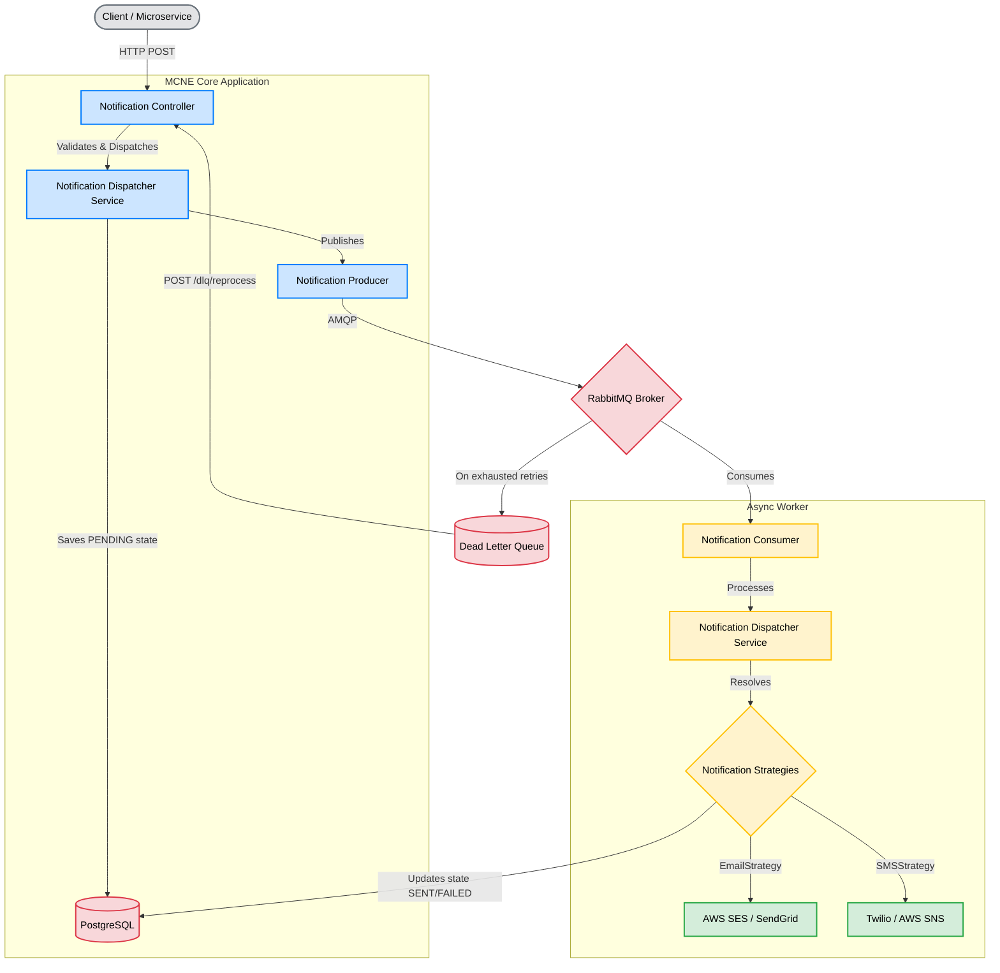
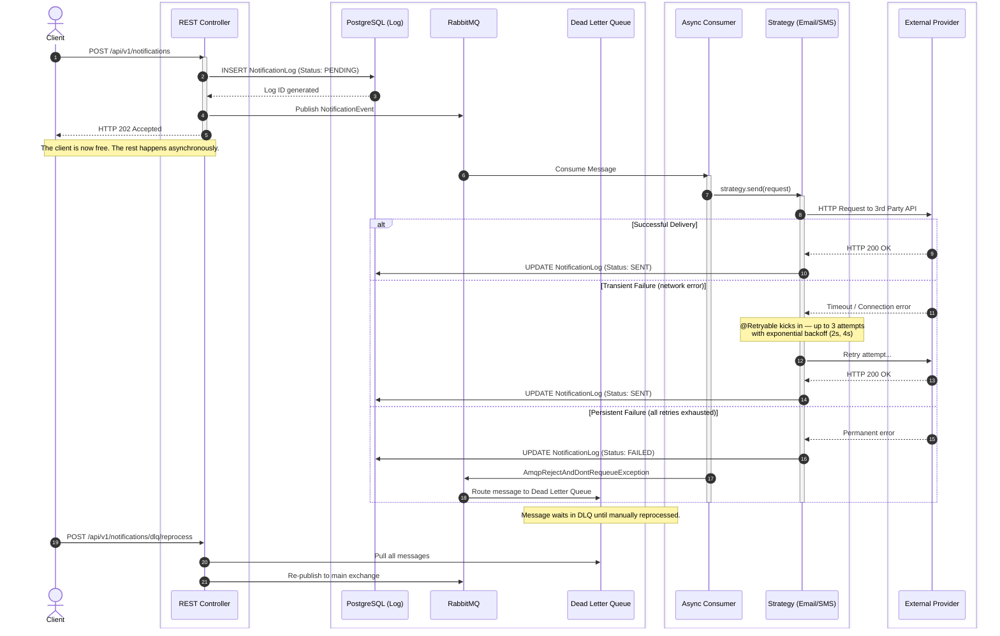
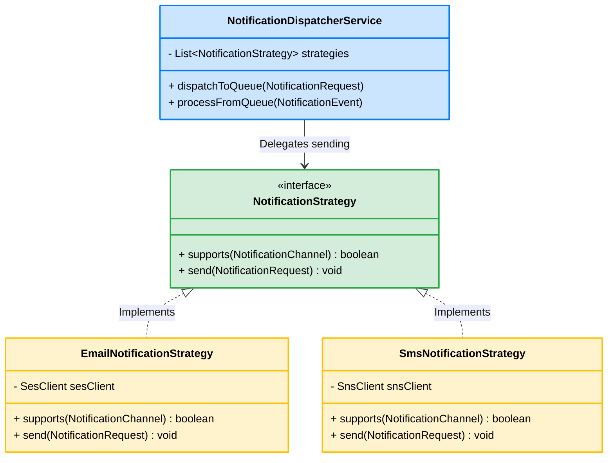
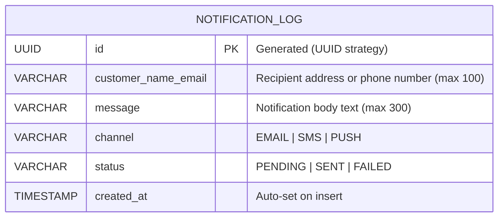

# System Architecture - Multi-Channel Notification Engine (MCNE)

This document provides a visual and technical breakdown of the MCNE architecture, focusing on its decoupled, asynchronous, and extensible design.

---

## 1. High-Level System Architecture

The system is designed around an event-driven architecture using RabbitMQ to decouple the HTTP ingestion layer from the actual external API delivery layer. This ensures that a spike in incoming requests does not overload external providers (like AWS SES or Twilio) and prevents clients from waiting for synchronous I/O operations.



---

## 2. Sequence Diagram (Asynchronous Flow, Retry & DLQ)

This diagram illustrates the full chronological flow of a notification request, including the retry mechanism and Dead Letter Queue routing on persistent failure.



---

## 3. Component Diagram (The Strategy Pattern)

The engine uses the **Strategy Design Pattern** to adhere to the Open/Closed Principle (OCP) from SOLID. If we need to add a new channel (e.g., Push Notification or Slack), we simply create a new class implementing the `NotificationStrategy` interface without touching the core `NotificationDispatcherService`.



---

## 4. Database Schema

The `notification_log` table is the single source of truth for tracking the lifecycle of every dispatched notification.



**Status Lifecycle:**

```
PENDING  →  SENT    (delivery confirmed by external provider)
PENDING  →  FAILED  (all retry attempts exhausted)
FAILED   →  PENDING (via DLQ reprocessing endpoint)
```

---

## 5. Retry & DLQ Architecture

The resiliency pipeline consists of two independent layers:

| Layer | Mechanism | Scope | Configuration |
|---|---|---|---|
| **Application-level** | `@Retryable(SdkClientException)` | Transient network errors | 3 attempts, 2s/4s backoff |
| **Broker-level** | RabbitMQ Dead Letter Exchange (DLX) | Messages rejected after all retries | Durable DLQ, manual reprocessing |

> **Important:** `@Retryable` is configured to only retry `SdkClientException` (network/timeout errors). Permanent AWS service errors (e.g., unverified sender address) are **not** retried and go directly to the DLQ.

---

## 6. Real-Time Observability (WebSockets)

To allow for real-time visual tracking of the asynchronous lifecycle, the engine implements a non-blocking **Observer Pattern** via STOMP WebSockets (`/ws-mcne`).

The `WebSocketEventPublisher` service broadcasts state changes to the `/topic/notifications` channel. These events include:
*   `QUEUED`: Emitted by the `NotificationDispatcherService` when a message is successfully sent to RabbitMQ.
*   `PROCESSING`: Emitted by the `NotificationConsumer` when a worker thread picks up the message.
*   `SENT`: Emitted by the strategies (`EmailNotificationStrategy`, `SmsNotificationStrategy`) upon successful AWS delivery.
*   `RETRYING`: Emitted by strategies when catching a transient `SdkClientException` before Spring Retry kicks in.
*   `DLQ`: Emitted before routing a permanently failed message to the Dead Letter Exchange.

**Demo & Simulation Mode:**
For demonstration and portfolio purposes, the engine supports a secure simulation mode. If an incoming HTTP request contains the header `X-MCNE-Client: Visualizer`, the engine allows the injection of specific metadata flags (`demoDelayMs` for artificial queue bottlenecking and `simulateError=true` to force AWS SDK exceptions). This allows external visualizers to demonstrate the retry and DLQ resiliency mechanisms safely, without polluting production traffic.
