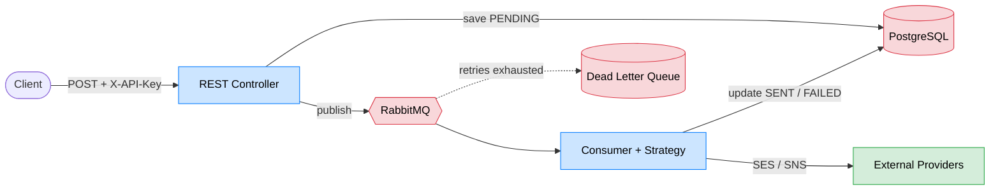
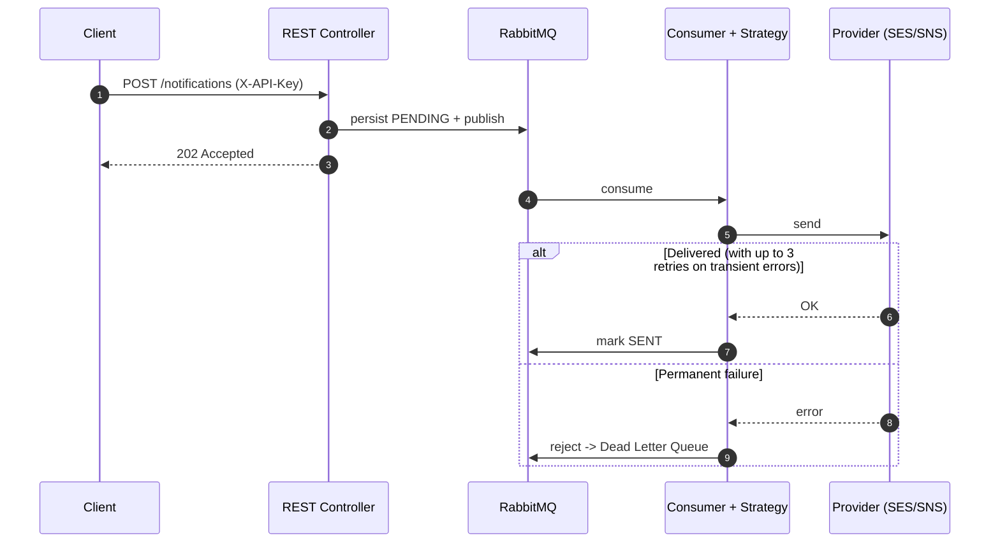
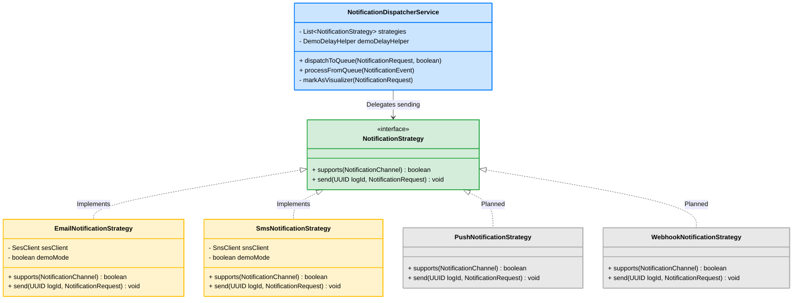
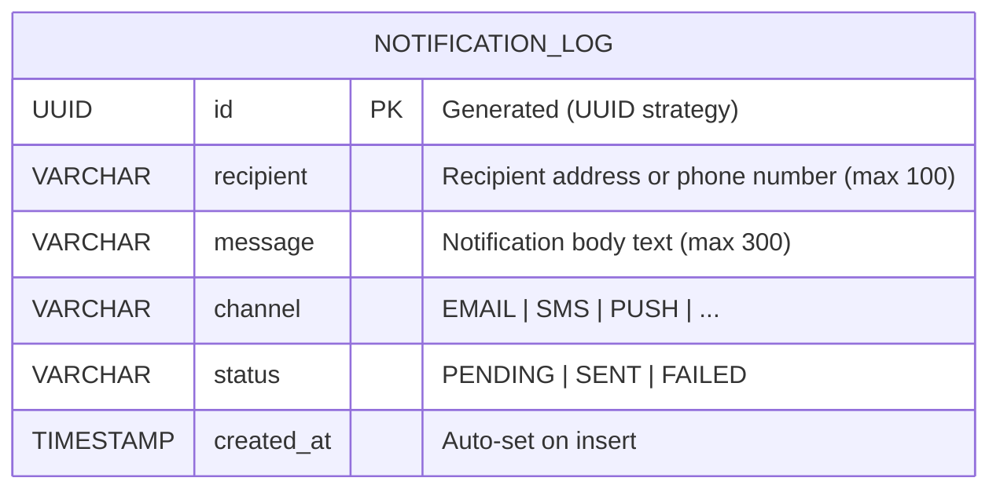

# System Architecture - Multi-Channel Notification Engine (MCNE)

This document provides a visual and technical breakdown of the MCNE architecture, focusing on its decoupled, asynchronous, extensible, and secure design.

## 1. High-Level System Architecture

An event-driven design uses RabbitMQ to decouple HTTP ingestion from external delivery. Clients get an immediate `202 Accepted`; delivery happens asynchronously, so a traffic spike never blocks callers or overloads providers. All `/api/**` endpoints are protected by an API key filter.



> A React Visualizer subscribes to STOMP WebSocket events (`/topic/notifications`) to render this flow in real time. See section 7 for the event lifecycle.

## 2. Sequence Diagram (Async Flow, Retry and DLQ)

The essential backend flow: the controller persists and enqueues, then a worker delivers with retry and DLQ fallback.



> Backoff is 2s/4s across 3 attempts (`@Retryable`). Failed messages rest in the DLQ until replayed via `POST /api/v1/notifications/dlq/reprocess`.

## 3. Extensibility: The Strategy Pattern

The engine uses the **Strategy Design Pattern** to adhere to the Open/Closed Principle (OCP) from SOLID. The `NotificationDispatcherService` resolves the correct strategy at runtime by calling `supports(channel)` on each registered bean, with no knowledge of which providers exist.

Adding a new delivery channel requires only one new class:

```java
@Component
public class PushNotificationStrategy implements NotificationStrategy {
    @Override
    public boolean supports(NotificationChannel channel) {
        return channel == NotificationChannel.PUSH;
    }

    @Override
    public void send(UUID logId, NotificationRequest request) {
        // Firebase FCM, APNs, or any push provider
    }
}
```

Spring automatically picks it up and injects it into the strategy list. The same pattern applies to any other channel: Twilio SMS, Slack, Microsoft Teams, outbound Webhooks, WhatsApp Business API, and so on.



## 4. Security Architecture

### API Key Authentication

All `POST` and `PUT` endpoints under `/api/**` are protected by a stateless API key filter implemented in `SecurityConfig`.

Flow:

1. Client sends `X-API-Key: <key>` with every request.
2. `apiKeyFilter` (a `OncePerRequestFilter`) compares the header value against the configured key.
3. On match: populates the `SecurityContext` with a `UsernamePasswordAuthenticationToken` (role `ROLE_API`) and forwards the request.
4. On mismatch: returns `401 Unauthorized` with a JSON error body and never reaches the controller.

Public endpoints (no key required):

- `GET /api/v1/status`
- `GET /actuator/health`, `GET /actuator/info`
- WebSocket handshake at `/ws-mcne/**`

| Property                | Env Variable   | Default (dev)  |
| ----------------------- | -------------- | -------------- |
| `mcne.security.api-key` | `MCNE_API_KEY` | `dev-only-key` |

Change `MCNE_API_KEY` to a strong random value before exposing the service publicly.

### CORS

CORS is managed centrally in `CorsConfig`. Allowed origins are driven by the `MCNE_ALLOWED_ORIGINS` environment variable (comma-separated). There are no `@CrossOrigin` annotations on individual controllers.

| Property                    | Env Variable           | Default (dev)           |
| --------------------------- | ---------------------- | ----------------------- |
| `mcne.cors.allowed-origins` | `MCNE_ALLOWED_ORIGINS` | `http://localhost:5173` |

### WebSocket Privacy

WebSocket events broadcast to `/topic/notifications` always carry `logId`, `eventType`, and `channel`. The `message` body is included only when the `demo` profile is active, so the Visualizer terminal can display it. In production, `WebSocketEventPublisher` strips the `message` field before broadcasting, since the topic is shared by all connected clients and the body could contain sensitive content. The recipient address is never broadcast.

### AWS Credentials

`AwsConfig` resolves credentials in the following order:

1. `DefaultCredentialsProvider` (IAM role, instance profile, or environment variables), used when `AWS_ACCESS_KEY` is blank. This is the expected path in staging and production.
2. Static fallback via `StaticCredentialsProvider`, used only when explicit keys are set through `AWS_ACCESS_KEY` and `AWS_SECRET_KEY`. Intended for local development only.

## 5. Database Schema

The `notification_log` table is the single source of truth for tracking the lifecycle of every dispatched notification.



Status lifecycle:

```
PENDING  ->  SENT    (delivery confirmed by external provider)
PENDING  ->  FAILED  (all retry attempts exhausted)
FAILED   ->  PENDING (via DLQ reprocessing endpoint)
```

## 6. Retry and DLQ Architecture

The resiliency pipeline consists of two independent layers:

| Layer             | Mechanism                           | Scope                               | Configuration                                                              |
| ----------------- | ----------------------------------- | ----------------------------------- | -------------------------------------------------------------------------- |
| Application-level | `@Retryable(SdkClientException)`    | Transient network errors            | 3 attempts, 2s/4s backoff                                                  |
| Broker-level      | RabbitMQ Dead Letter Exchange (DLX) | Messages rejected after all retries | Durable DLQ, manual reprocessing (poison messages discarded after 3 trips) |

`@Retryable` is configured to only retry `SdkClientException` (network and timeout errors). Permanent provider errors (e.g. unverified SES sender address) are not retried and go directly to the DLQ.

## 7. Real-Time Observability (WebSockets)

The engine implements a non-blocking Observer Pattern via STOMP WebSockets (`/ws-mcne`). The `WebSocketEventPublisher` service broadcasts state changes to `/topic/notifications`. Each event payload contains `logId`, `eventType` (a `NotificationEventType` enum), `channel`, and `message`. The `message` field is stripped in production (see WebSocket Privacy above) and kept in demo mode for the Visualizer.

| Event        | Emitted by                      | Meaning                                                    |
| ------------ | ------------------------------- | ---------------------------------------------------------- |
| `RECEIVED`   | `NotificationDispatcherService` | HTTP request accepted, log entry created                   |
| `QUEUED`     | `NotificationDispatcherService` | Message published to RabbitMQ                              |
| `PROCESSING` | `NotificationConsumer`          | Worker thread picked up the message                        |
| `RETRYING`   | Strategy implementations        | Transient error caught, Spring Retry will attempt again    |
| `SENT`       | Strategy implementations        | Delivery confirmed by the external provider                |
| `DLQ`        | `NotificationDispatcherService` | All retries exhausted, message routed to Dead Letter Queue |

### Demo Mode

A `demo` Spring profile activates additional behaviour for portfolio demonstration:

- `DemoConfig` registers a servlet filter that marks requests containing `X-MCNE-Client: Visualizer`.
- `NotificationConsumer` and strategy implementations apply artificial delays (`demoDelayMs` metadata) to make the pipeline flow visible in the Visualizer frontend.
- Strategies accept `simulateError=true` to force `SdkClientException`, triggering the retry and DLQ flow without real AWS calls.

The entire demo code path is inactive when the `demo` profile is not enabled. The `demoMode` flag is injected via `@Value("#{environment.acceptsProfiles('demo')}")` and short-circuits all simulation logic at runtime.

To activate: `--spring.profiles.active=demo`

## 8. Configuration Reference

### Environment Variables

| Variable               | Property                     | Description                                             | Default (dev)           |
| ---------------------- | ---------------------------- | ------------------------------------------------------- | ----------------------- |
| `DB_USERNAME`          | `spring.datasource.username` | PostgreSQL username                                     | `mcne_user`             |
| `DB_PASSWORD`          | `spring.datasource.password` | PostgreSQL password                                     | `mcne_password`         |
| `DB_NAME`              | `spring.datasource.url`      | PostgreSQL database name                                | `mcne_db`               |
| `AWS_REGION`           | `aws.region`                 | AWS region for SES/SNS                                  | `us-east-2`             |
| `AWS_ACCESS_KEY`       | `aws.accessKeyId`            | AWS access key (blank = use DefaultCredentialsProvider) | _(blank)_               |
| `AWS_SECRET_KEY`       | `aws.secretKey`              | AWS secret key (blank = use DefaultCredentialsProvider) | _(blank)_               |
| `AWS_VERIFIED_EMAIL`   | `aws.ses.verified-email`     | Verified SES sender email                               | `none@example.com`      |
| `MCNE_API_KEY`         | `mcne.security.api-key`      | API key for `X-API-Key` header                          | `dev-only-key`          |
| `MCNE_ALLOWED_ORIGINS` | `mcne.cors.allowed-origins`  | Comma-separated allowed CORS origins                    | `http://localhost:5173` |

### Infrastructure Ports (Local Docker)

| Service       | Internal Port | External Port                          |
| ------------- | ------------- | -------------------------------------- |
| PostgreSQL    | 5432          | 5435 (non-standard to avoid conflicts) |
| RabbitMQ AMQP | 5672          | 5672                                   |
| RabbitMQ UI   | 15672         | 15672                                  |
| MCNE App      | 8081          | 8081                                   |
